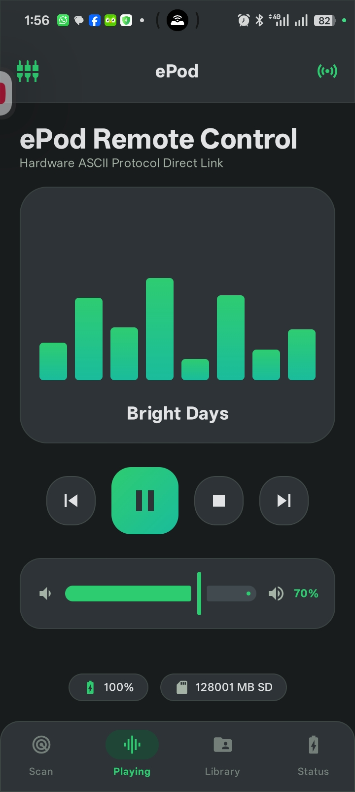
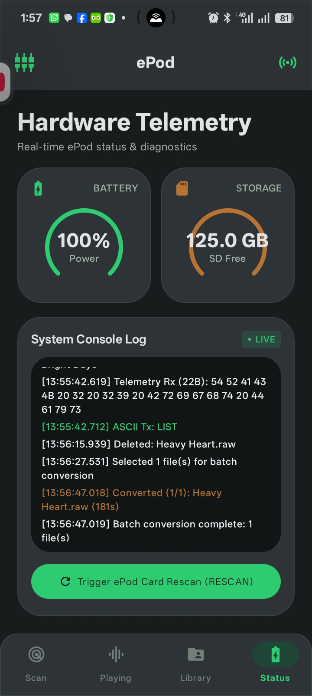
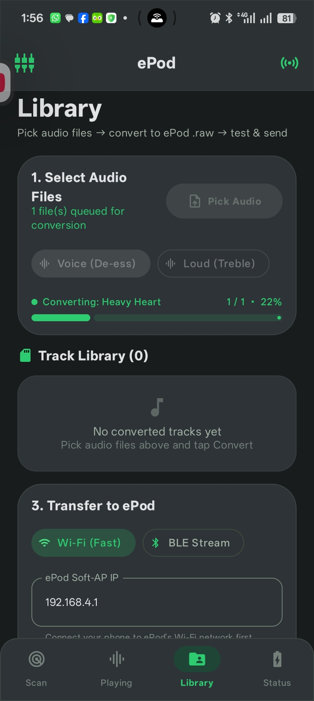
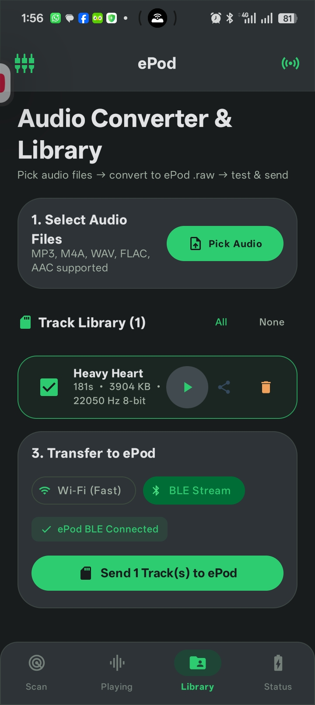
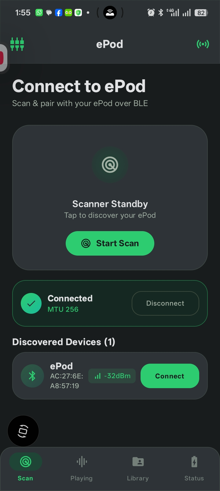
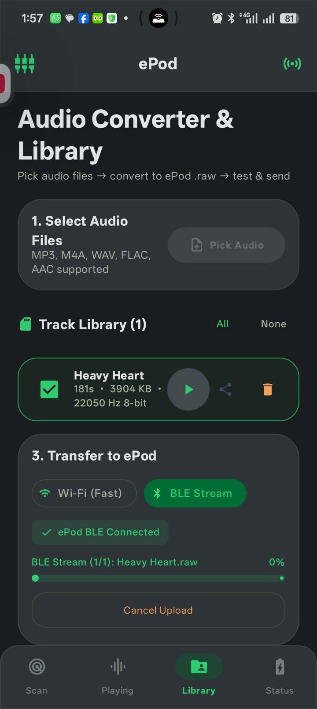
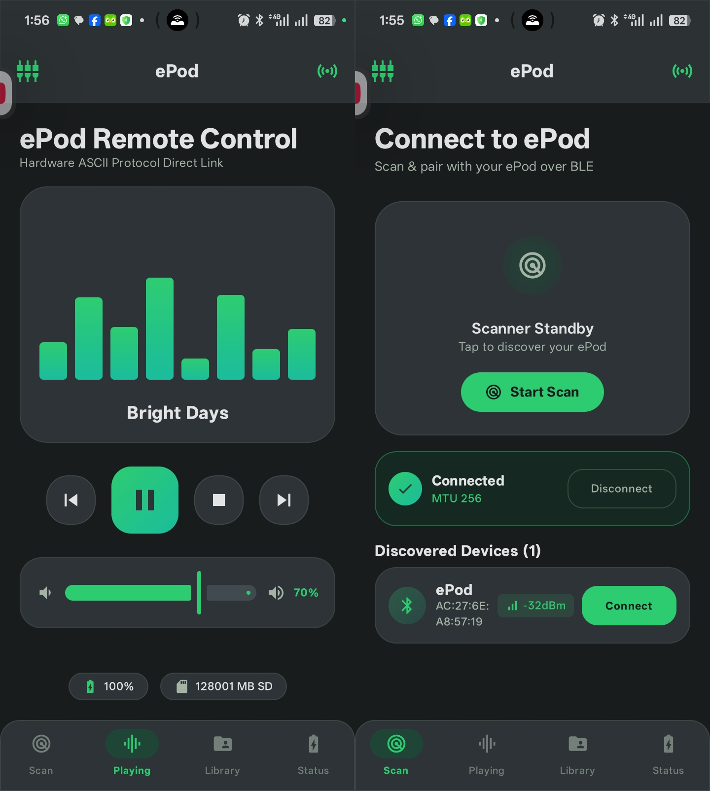

<div align="center">

# ePodd — ePod Companion App

**An Android app that converts music for the ePod, sends it over, and controls playback.**

[](https://android.com)
[](https://kotlinlang.org)
[](https://developer.android.com/jetpack/compose)
[](#)
[](#)

</div>

The ePod plays raw 8-bit PCM off an SD card and nothing else, so tracks have to
be converted before they get there. This app does the conversion on the phone,
lets you listen to the result first, and then sends the files to the device over
Wi-Fi or Bluetooth. It also works as a remote control, with transport buttons,
volume, and a status page for battery and storage.

[← back to the project README](../README.md)

---

## Table of Contents

- [Screens](#screens)
- [What it does](#what-it-does)
- [How a track gets to the device](#how-a-track-gets-to-the-device)
- [Audio format](#audio-format)
- [Command protocol](#command-protocol)
- [Building](#building)
- [Permissions](#permissions)

---

## Screens

<div align="center">

| Find and connect | Remote control | Status and logs |
| :---: | :---: | :---: |
|  |  |  |
| Scan for the ePod over BLE, with signal strength per device | Transport buttons, volume, and a level meter | Battery, free SD space, and the raw command log |

| Pick and convert | Conversion queue | Preview |
| :---: | :---: | :---: |
|  |  |  |
| Choose files and a sound profile, Voice or Loud | Converts one after another, with progress per file | Play the converted file on the phone before sending it |

| Connected | Sending over BLE |
| :---: | :---: |
|  |  |
| Stays connected and polls the device for status | Sends the file in MTU-sized chunks, with progress |

</div>

<div align="center">

| Remote control and pairing | Status and transfers |
| :---: | :---: |
|  |  |

</div>

---

## What it does

### Convert audio

- Reads `.mp3`, `.m4a`, `.wav`, `.flac` and `.aac`, and writes the headerless
  `.raw` PCM the ePod expects.
- Mixes to mono, resamples to 22,050 Hz, and quantises to unsigned 8-bit.
- Replaces any `0x00` byte with `0x01`. A null byte would end the UART string
  early and cut the track off.
- Two sound profiles:
  - **Voice**: high-pass at 80 Hz, a notch at 6.5 kHz (−7 dB), and dynamic range
    normalisation. Speech-heavy tracks come out clearer and less harsh on an
    8-bit output.
  - **Loud**: keeps the high frequencies as they are. Better for music.
- Converts several files in a row, showing progress for each one.

### Keep a library on the phone

- Converted tracks are kept in the app cache (`/epod_raw`), so they survive an
  app restart, a re-pair, or switching tabs.
- Each track can be played back on the phone speaker through Android's
  `AudioTrack`, so you can hear the 8-bit result before sending it.
- Tracks can be selected, shared, or deleted from the cache.

### Send tracks to the device

- **Over Wi-Fi**: joins the ePod's access point (`ePod-Music`) and POSTs the file
  to `http://192.168.4.1/upload`, straight onto the SD card. This is the fast
  path. When the upload finishes the app sends `RESCAN` so the device re-indexes
  the card.
- **Over BLE**: splits the file into MTU-sized packets and writes them in order
  to characteristic `EP03`. Slower, but it works without Wi-Fi.

### Control the device

- `PLAY`, `PAUSE`, `STOP`, `NEXT` and `PREV`.
- A volume slider that sends `VOL <n>`. If you change the volume with the
  buttons on the ePod, the device reports the new level back and the slider
  follows it.
- A level meter driven by playback.
- Scanning for a device opens over the current screen, so you do not lose the
  conversion queue or your selection.

### Show device status

- Battery percentage and free SD space, as circular gauges.
- A console view of the raw ASCII lines going in and out.

---

## How a track gets to the device

```
                   +-----------------------------------+
                   |   Audio file on the phone         |
                   |   (MP3, M4A, WAV, FLAC, AAC)      |
                   +-----------------------------------+
                                     |
                                     v
                   +-----------------------------------+
                   |   Convert on the phone            |
                   |   - mono, 22050 Hz                |
                   |   - unsigned 8-bit (0x01-0xFF)    |
                   |   - Voice or Loud profile         |
                   |   - replace 0x00 with 0x01        |
                   +-----------------------------------+
                                     |
                                     v
                   +-----------------------------------+
                   |   Saved in the app cache          |
                   |   playable on the phone speaker   |
                   +-----------------------------------+
                                     |
                                     v
                   +-----------------------------------+
                   |   Pick a transport                |
                   +-----------------------------------+
                            /               \
                           /                 \
      +----------------------------+   +----------------------------+
      |  Wi-Fi upload over HTTP    |   |  BLE transfer              |
      |  http://192.168.4.1/upload |   |  GATT EP03, chunked        |
      +----------------------------+   +----------------------------+
                       |                            |
                       +-------------+--------------+
                                     |
                                     v
                   +-----------------------------------+
                   |   ePod                            |
                   |   - DAC via DMA                   |
                   |   - SD card (/music/)             |
                   +-----------------------------------+
```

---

## Audio format

| Attribute | Value | Why |
|---|---|---|
| Stream | Raw PCM, no header | Feeds the DAC's DMA buffer directly |
| Sample depth | Unsigned 8-bit (`0x01`–`0xFF`) | Matches the DAC |
| Sample rate | 22,050 Hz | Fixed by the firmware's playback clock |
| Channels | Mono | Stereo is averaged: (L + R) / 2 |
| Silence | `0x80` (128) | Mid-point for unsigned samples |
| Byte clamp | `0x00` → `0x01` | A null byte would end the UART string early |
| Filename | 32 characters, alphanumeric | Keeps FAT32 happy |

---

## Command protocol

The app talks to the ePod with plain ASCII lines over BLE or serial:

| Command | Description |
|---|---|
| `PLAY` | Resume playback |
| `PAUSE` | Pause playback |
| `STOP` | Stop and reset the DAC buffer |
| `NEXT` | Next track |
| `PREV` | Previous track |
| `VOL <0-100>` | Set the volume |
| `INFO` | Ask for battery level and SD status |
| `LIST` | Ask for the current track index and total |
| `RESCAN` | Re-index the SD card |

---

## Building

You need Android Studio (Ladybug or newer), JDK 17 or higher, and Android SDK
API level 34.

```bash
# Windows
.\gradlew.bat assembleDebug

# Linux / macOS
./gradlew assembleDebug
```

The APK lands at `app/build/outputs/apk/debug/app-debug.apk`.

---

## Permissions

The manifest already asks for what BLE scanning and plain-HTTP uploads need:

```xml
<!-- Bluetooth and location -->
<uses-permission android:name="android.permission.BLUETOOTH" />
<uses-permission android:name="android.permission.BLUETOOTH_ADMIN" />
<uses-permission android:name="android.permission.BLUETOOTH_SCAN" />
<uses-permission android:name="android.permission.BLUETOOTH_CONNECT" />
<uses-permission android:name="android.permission.ACCESS_FINE_LOCATION" />

<!-- Network, and cleartext HTTP for the ePod's access point -->
<uses-permission android:name="android.permission.INTERNET" />
<uses-permission android:name="android.permission.ACCESS_NETWORK_STATE" />
<uses-permission android:name="android.permission.CHANGE_NETWORK_STATE" />

<application
    android:usesCleartextTraffic="true" ... >
```

`usesCleartextTraffic` is needed because the ePod serves plain HTTP at
`http://192.168.4.1/upload`, which recent Android versions block by default.
